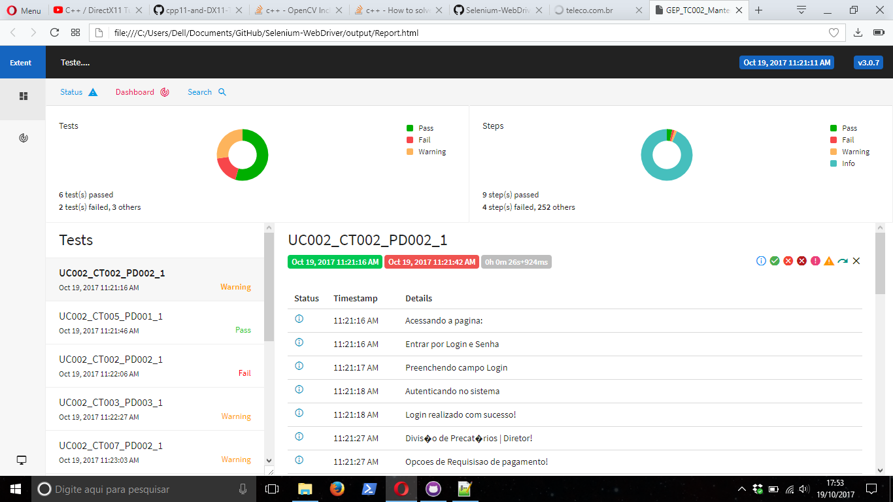

# Test-Case-WebDriver
## Automatização de Casos de Teste implementado em java para o sistema GEP (Gestão Eletronica de precatórios), TRT 8º Região. 
* Selenium WebDriver
* TestNG
* Extent Report
* Test Case

### Print de Execução
 
