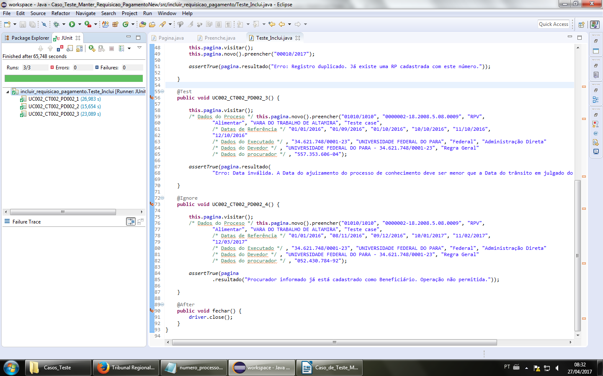

# Teste-Case-WebDriver
## Automatização de Casos de Teste implementado em java para o sistema GEP (Gestão Eletronica de precatórios), TRT 8º Região. 
* Selenium WebDriver
* Junit
* Test Case
* AspectJ
### Print de Execução

